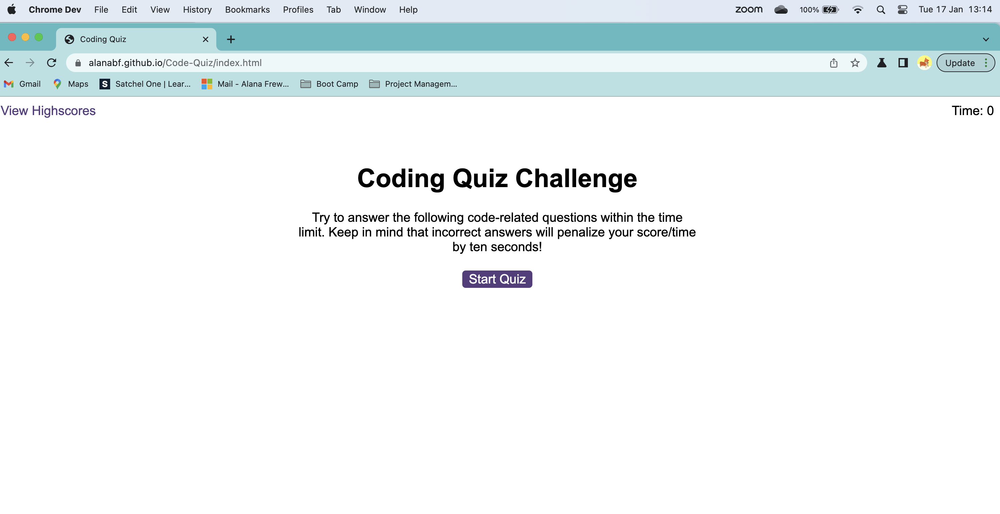
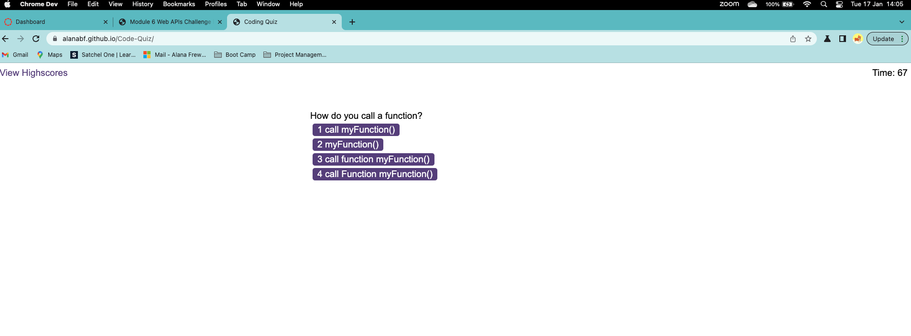

# Code-Quiz
A time coding quiz with multiple-choice questions.

## Overview

 Tasked to build a timed coding quiz with multiple-choice questions. This app runs in the browser, and features dynamically updated HTML and CSS powered by JavaScript code that I have written. It has a clean, polished, and responsive user interface. 

 https://alanabf.github.io/Code-Quiz/ 

## User Story

```
AS A coding boot camp student
I WANT to take a timed quiz on JavaScript fundamentals that stores high scores
SO THAT I can gauge my progress compared to my peers
```

## Functionality

Code quiz that contains the following functions:

* A start button that when clicked a timer starts and the first question appears.

  * Questions contain buttons for each answer.
  
  * When answer is clicked, the next question appears
  
  * If the answer clicked was incorrect then subtract time from the clock

* The quiz ends when all questions are answered or the timer reaches 0.

  * When the game ends, it displays their score and gives the user the ability to save their initials and their score.

## Usage

Javascript code is used to run through user answers to questions, logs whether they are right or wrong and gives the score at the end. The user logs their initials and this score is logged in the local storage area. 





## Technology Used

* JavaScript elements
* The DOM
* CSS and html files partially pre-built
* JSON
* Local Storage

## Credits

N/A

## License

MIT

---